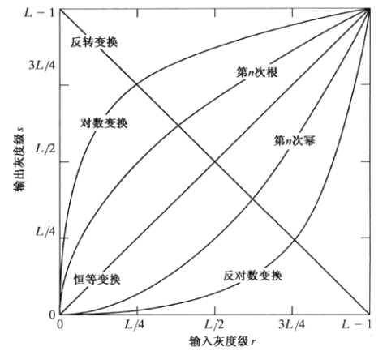
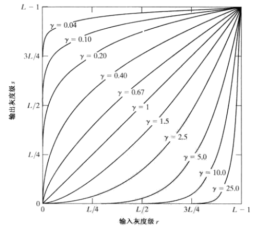
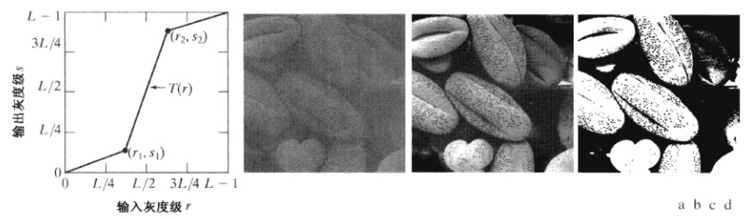
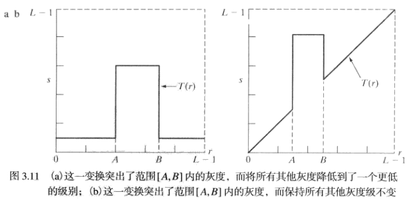
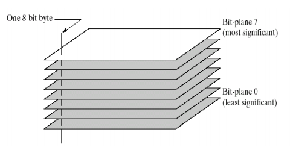

### 1. 图像反转

获取像素值在`[0, L]`范围内的图像的反转图像. 适用于增强图像中白色或者灰色的区域, 尤其当黑色在图片中占主地位时候.

```
T(r) = L - r
```

### 2. 对数变换



由于对数曲线在像素值较低的区域斜率大, 在像素值较高的区域斜率较小, 所以图像经过对数变换后, 较暗区域的对比度将有所提升. 可用于增强图像的暗部细节.

```
s = c * log(1 + r)
```

### 3. 幂律(伽马)变换



伽马变换可以很好地拉伸图像的对比度, 扩展灰度级. 由图可知, 当图像的整体灰度偏暗时, 选择gamma<1, 可以使图像增亮; 当图像整体灰度偏亮时, 选择gamma>1, 可以使图像变暗, 提高图像的对比度, 凸显细节.

用于图像获取、打印和显示的各种设备根据幂律来产生响应, 用于校正这些幂律响应现象的处理称为**伽马校正**. 
例如, 阴极射线管(CRT)设备有一个灰度-电压响应, 该响应是一个指数变化范围约为1.8~2.5的幂函数.

```
s = c * r ^ (gamma)
```

### 3. 分段线性变换

#### 4.1 对比度拉伸



#### 4.2 灰度级分层



#### 4.3 比特平面切片




