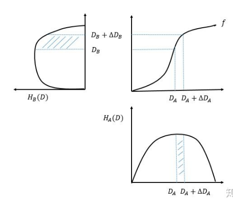

### 1. 直方图均衡化

- 直方图均衡化的目的: 寻找变换函数, 该函数产生有均匀直方图的输出图像. 也就是得到一幅灰度级丰富且动态范围大的图像;

- 该函数仅仅依靠输入图像直方图中的信息就可以自动达到这一点;

- 直方图均衡化的关键: 寻找变换函数, 该函数产生有均匀直方图的输出图像.

- 直方图均衡化的原理:
    - 考虑连续函数并且让变量r代表待增强图像的灰度级. 假设r被归一化到期间[0, 1], 且r=0表示黑色及r=1表示白色.
    - 对于任一个满足上述条件的r, 我们将注意力集中在变换形式`s = T(r)   0 <= r <=1`上, 假设变换函数`T(r)`满足以下条件: 
    `(a) T(r)在区间0<=r<=1中单值且单调递增; (b) 当0<=r<=1时, 0<=T(r)<=1`
    
 
 
 
 ### 2. 直方图匹配(规定化)
 
 ### 3. 局部直方图增强