### 空间滤波基础

- 图像的平滑、锐化都是利用掩模操作来完成的. 通过**掩模操作**实现一种领域运算, 待处理像素点的结果由领域的图像像素以及相应的与领域有相同维数的
子图像得到. 这些子图像被称为**滤波器、掩模、核、模板或窗口**;

- 掩模运算的数学含义是**卷积**(或**互相关**)运算;

- 掩模子图像中的值是系数值, 而不是灰度值;

### 空间平滑滤波器

用途: 用于模糊处理和减少噪声.

- 典型的随机噪声由灰度级的急剧变化组成;

- 平滑处理降低了图像的"尖锐"变化;

- "负面效应": 图像边缘模糊化; (图像边缘也由灰度级的急剧变化组成)

#### 平滑线性滤波器

用包含在滤波掩模领域内的像素的平均灰度值去代替每个像素点的值. 又叫: 均值滤波器

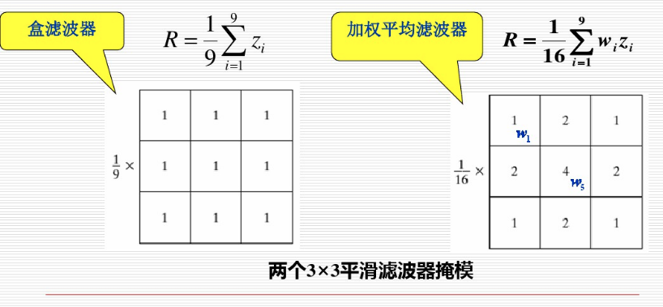

- 模板尺寸对过滤器效果的影响: 模板尺寸越大, 图像越模糊, 细节丢失越多;

- 平滑空域滤波的缺点和问题: 如果图像处理的目的是去除噪音, 那么, 平滑滤波在去除噪音的同时也钝化了图像的边和尖锐的细节.

#### 统计排序滤波器

一种非线性滤波器《 它的响应基于图像滤波器包围的图像区域中像素的排序, 然后由**统计排序结果决定的值代替中心像素的值**. 最常见的是中值滤波器.

##### 中值滤波器

- 算法: 先将掩模内欲求的像素及其邻域内的像素值排序(升序或降序), 确定出中值, 并**将中值赋予该像素点**.

- 主要功能: 使拥有不同灰度的点看起来更接近于它的临近值.

- 主要用途: 去除"椒盐"噪声

##### 最大值滤波器

##### 最小值滤波器

#### 空间锐化滤波器

- 锐化处理的目的: 是突出图像中的细节或者增强被模糊了的细节.

- 锐化处理可以用空间微分来完成. 微分算子的响应强度与图像在该点的突变程度相关, 图像微分增强了边缘和其他突变(如噪声)而消弱了灰度变化缓慢的区域.

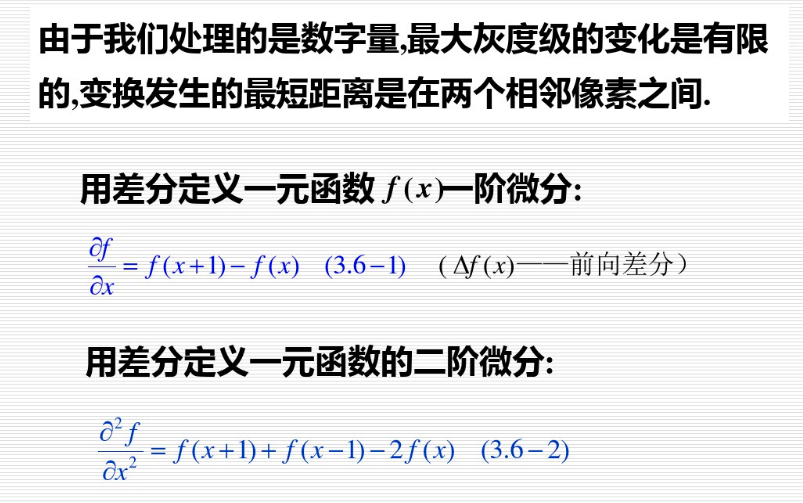

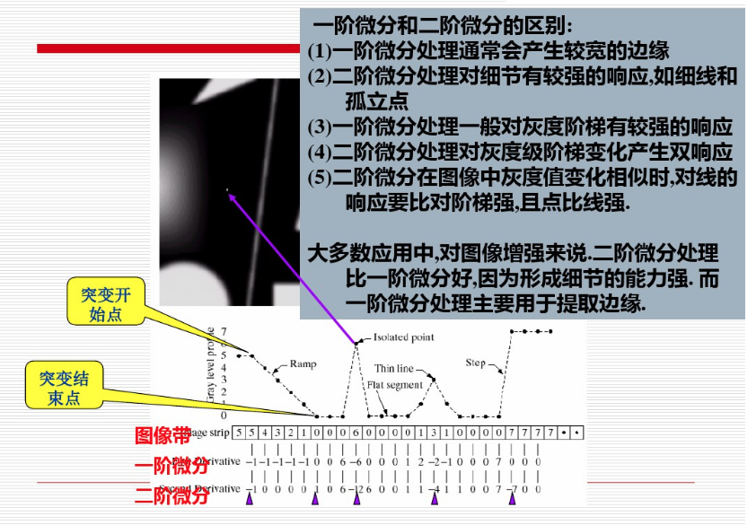

基于二阶微分的图像增强——拉普拉斯算子

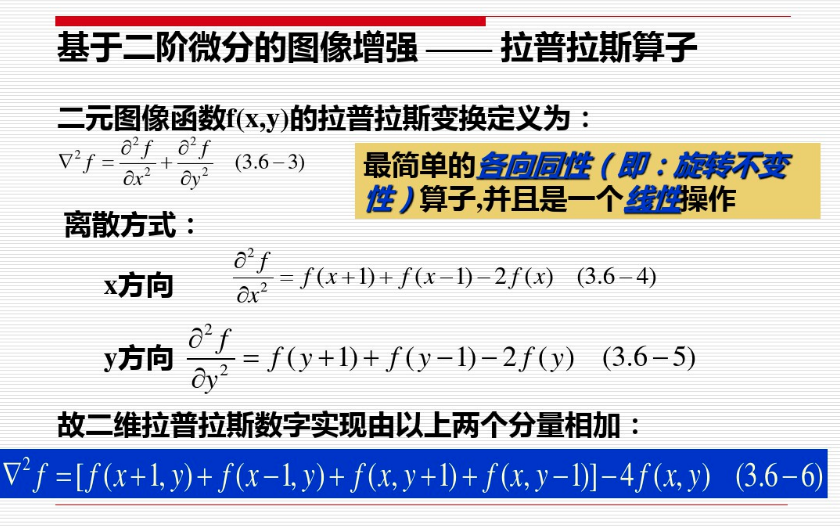

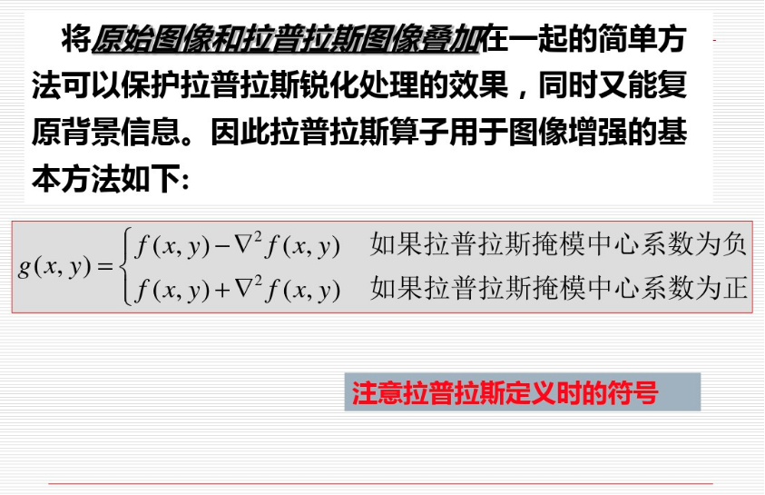

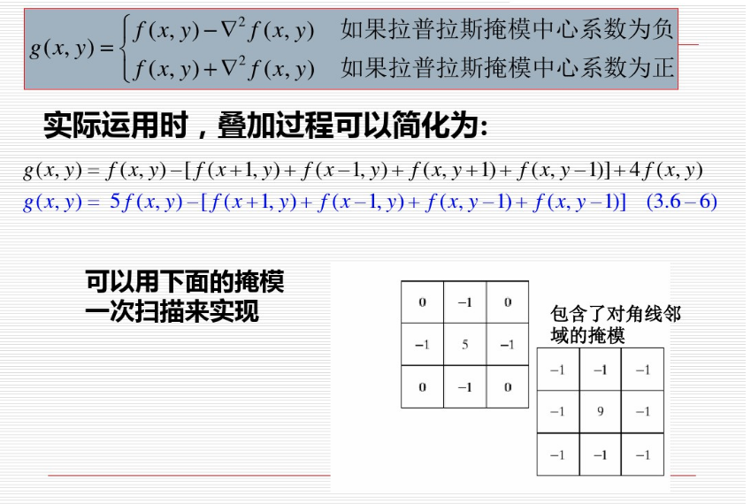

基于一阶微分的图像增强——梯度算子

- Roberts交叉梯度算子

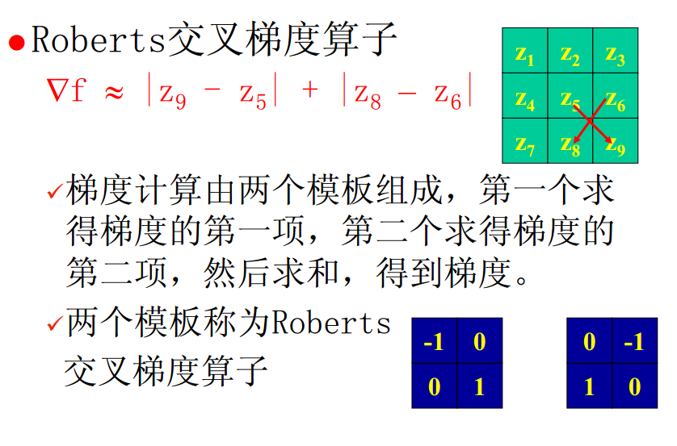

- Prewitt梯度算子

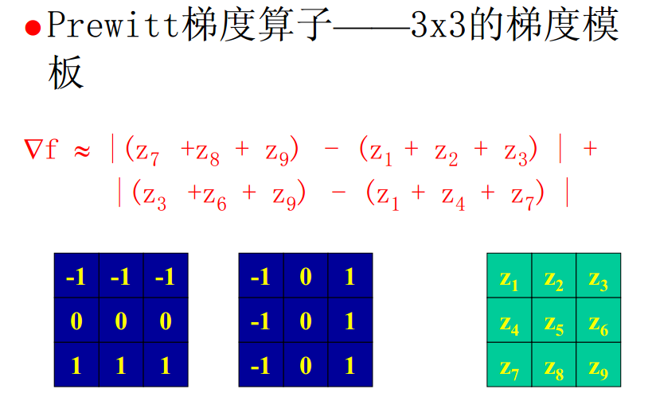

- Sobel梯度算子

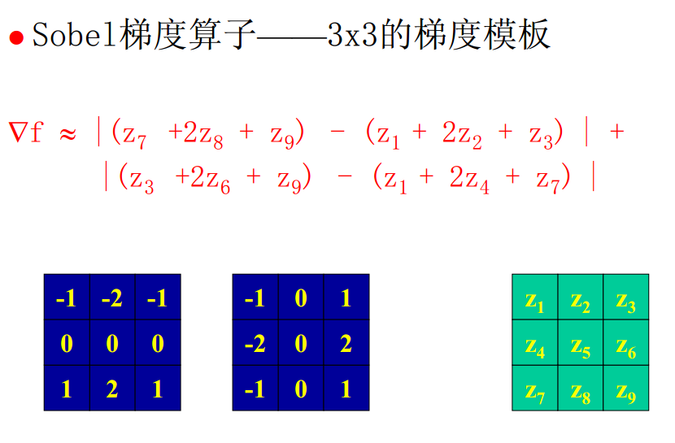

微分算子小结

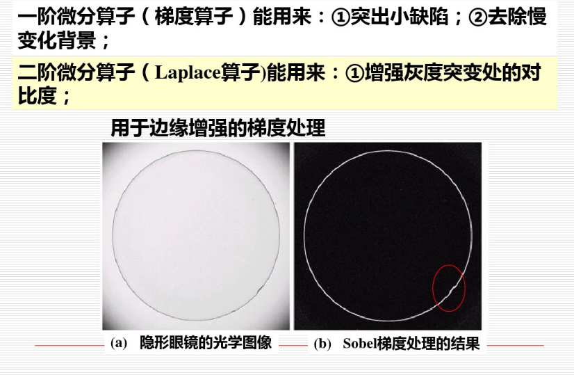

### 混合空间增强

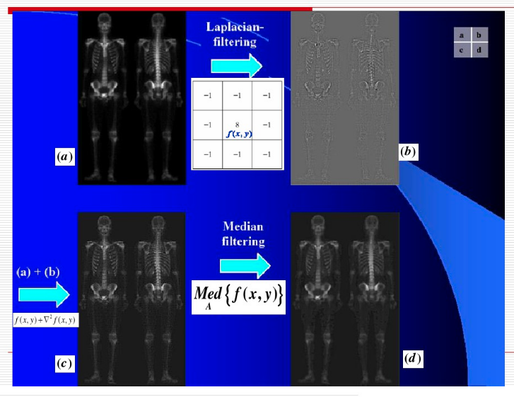

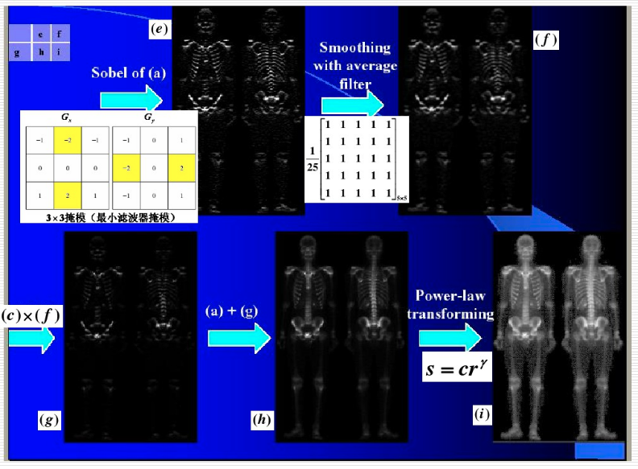

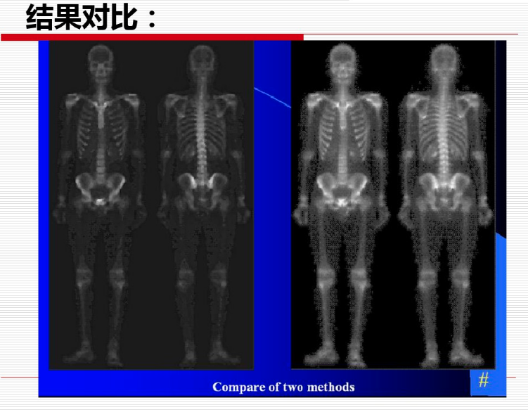

