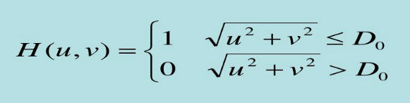
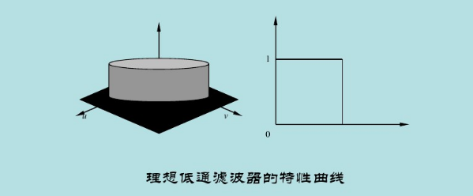
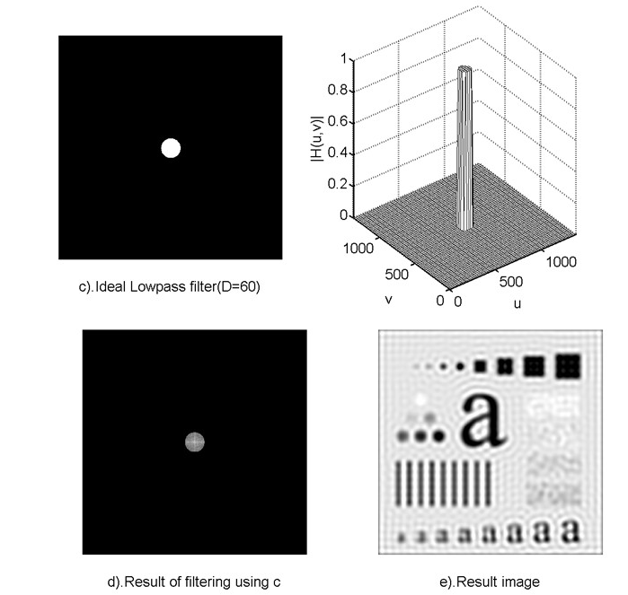
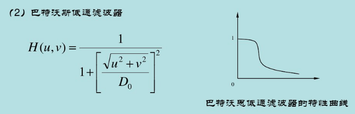
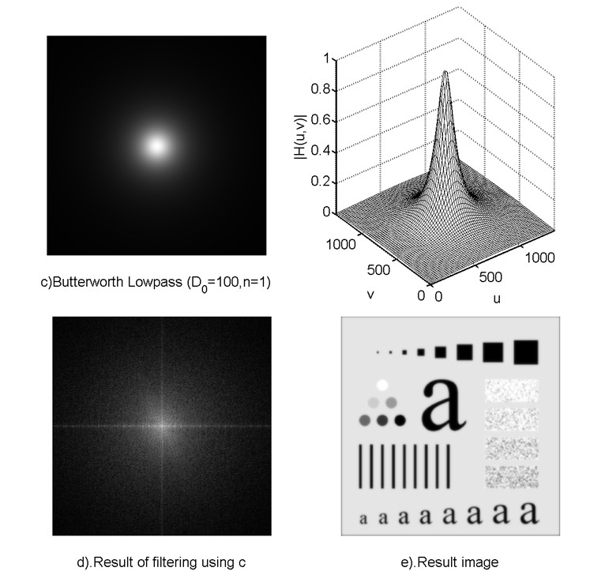
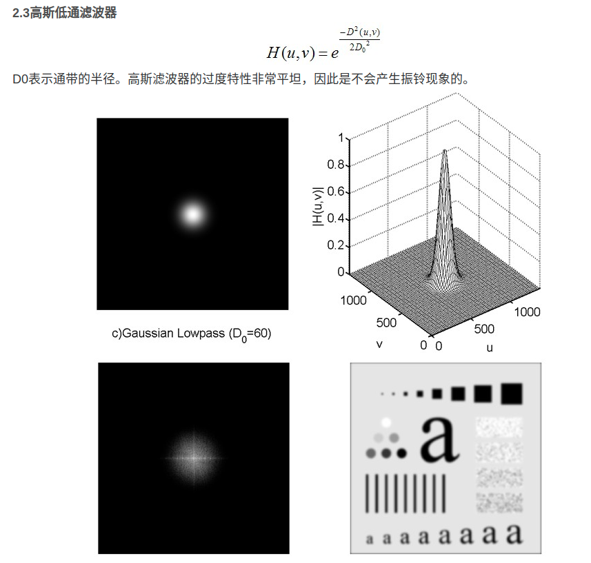

边缘和其他尖锐变化(如噪声)在图像的灰度级中主要处于傅里叶变换的高频部分. 因此, 平滑(模糊)可以通过衰减指定图像傅里叶变换中高频成分的范围来实现.

```
G(u, v) = H(u, v)F(u, v)
```

目标是选择一个滤波器变换函数`H(u, v)`以衰减`F(u, v)`的高频成分产生`G(u, v)`.

- 理想低通滤波器

- 巴特沃斯低通滤波器

- 高斯低通滤波器

#### 1. 理想低通滤波器

最简单的低通滤波器是"截断"傅里叶变换中所有高频成分, 这些成分处在距离变换原点的距离比指定距离D0要远得多的位置. 这种滤波器称为二维理想低通滤波器, 
其变换函数为:





使用低通滤波器所得到的结果如下所示. 低通滤波器滤除了高频成分, 所以使得图像模糊. 由于理想低通滤波器的过度特性过于急峻, 所以会产生了振铃现象.



#### 2. 巴特沃斯低通滤波器



同样的, D0表示通带的半径, 2表示的是巴特沃斯滤波器的次数. 随着次数的增加, 振铃现象会越来越明显.



#### 3. 高斯低通滤波器



