灰度级的边缘和其他地方的急剧变化与高频成分有关, 图像的锐化能够在频率域用高通滤波器实现, 而衰减低频成分并不会扰乱傅里叶变换的高频信息.

#### 理想高通滤波器

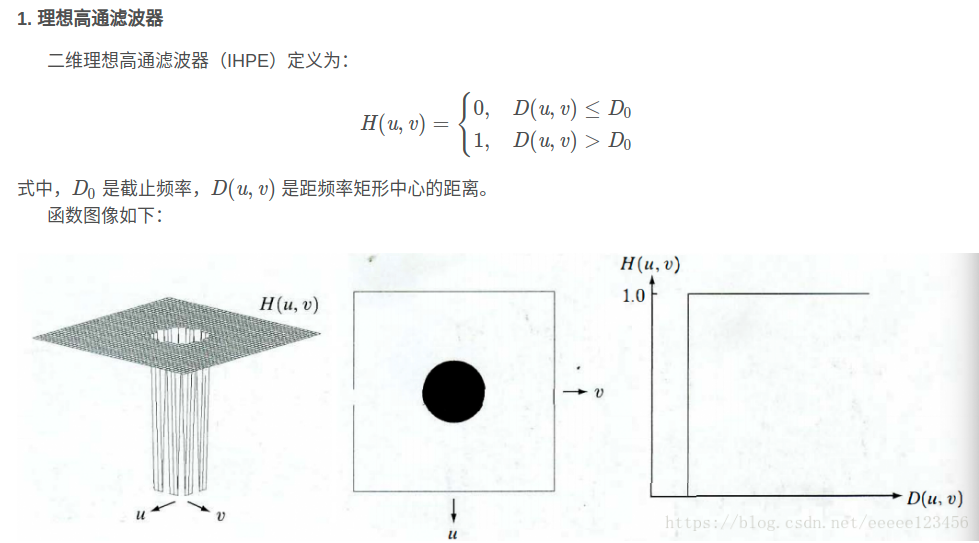

#### 巴特沃斯高通滤波器

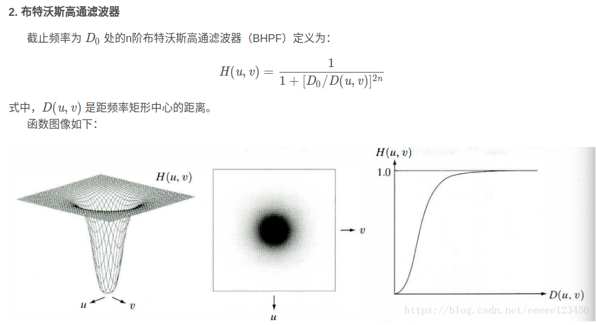

#### 高斯高通滤波器

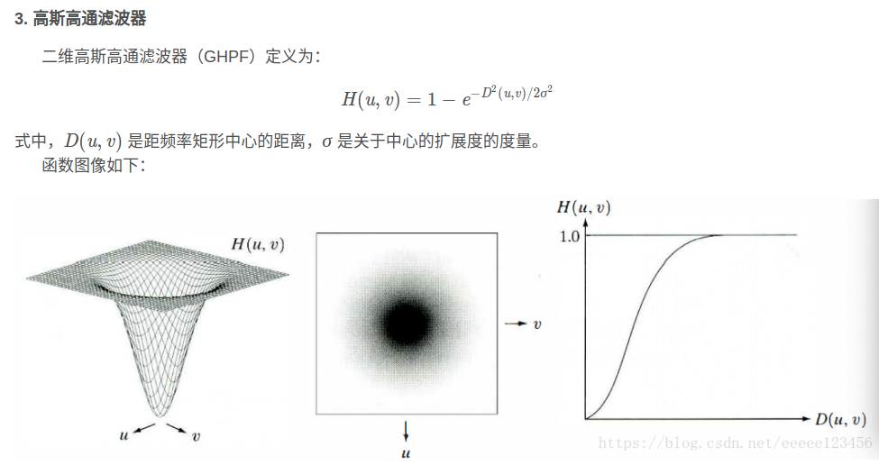

#### 频率域的拉普拉斯算子

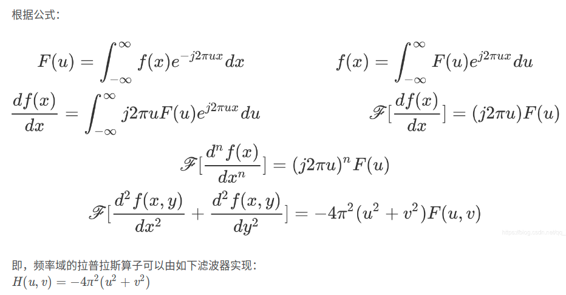

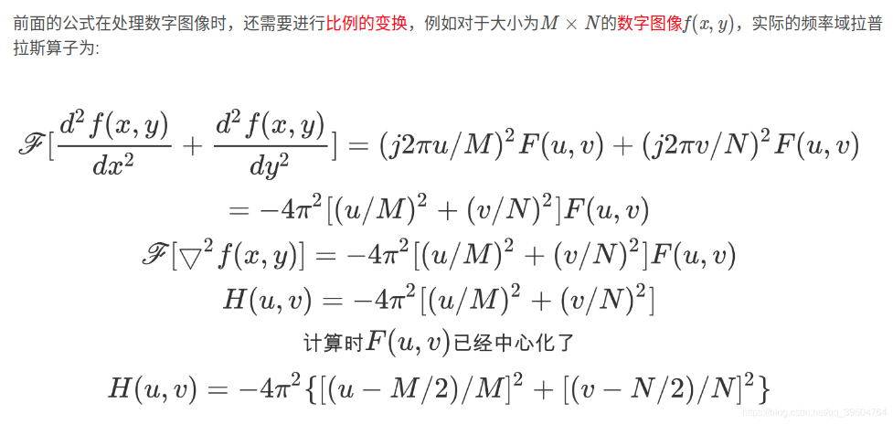

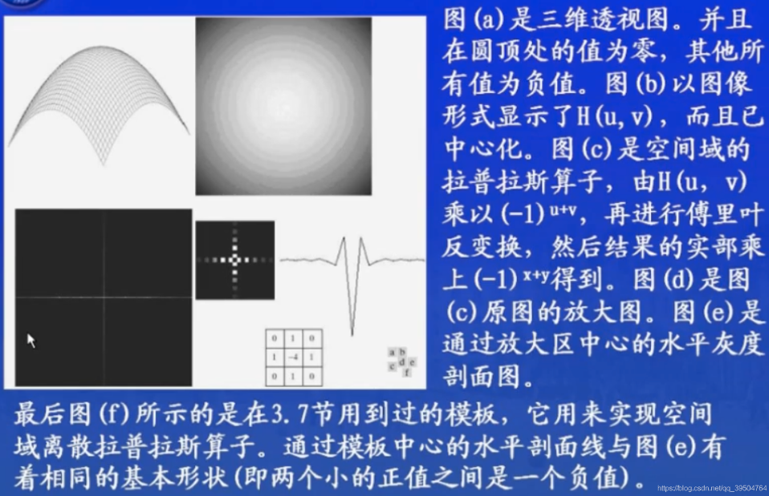

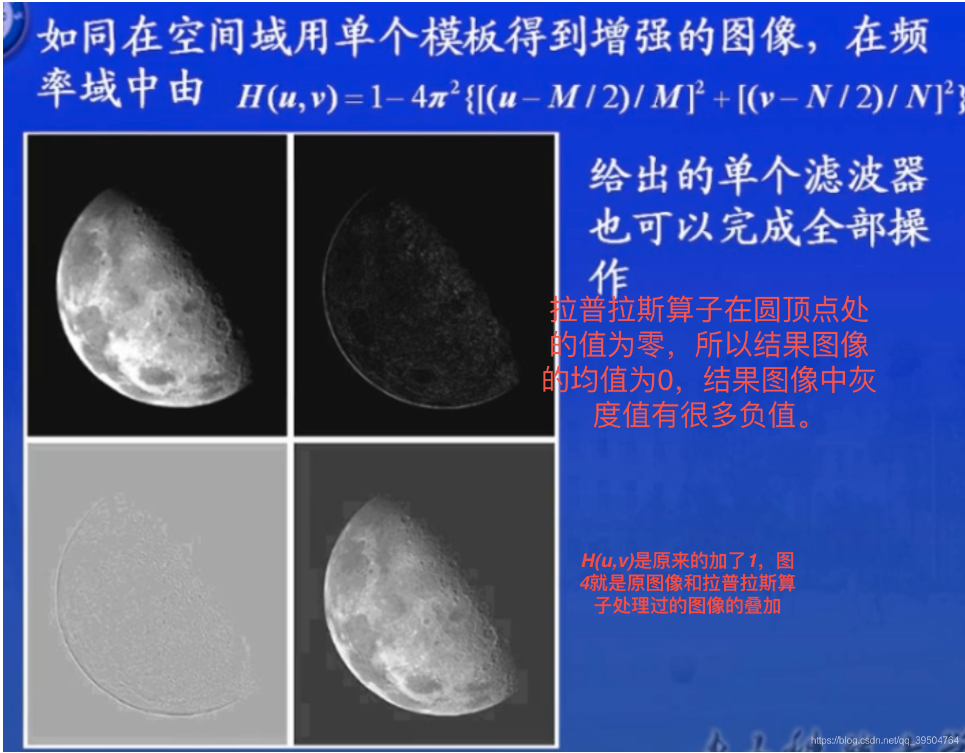

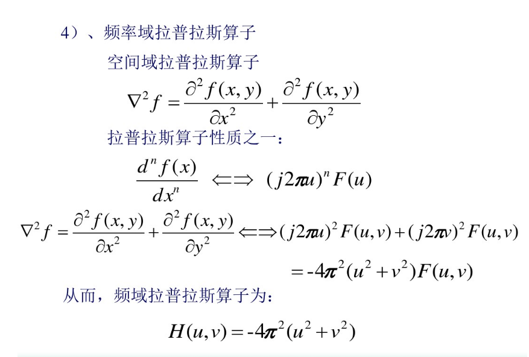

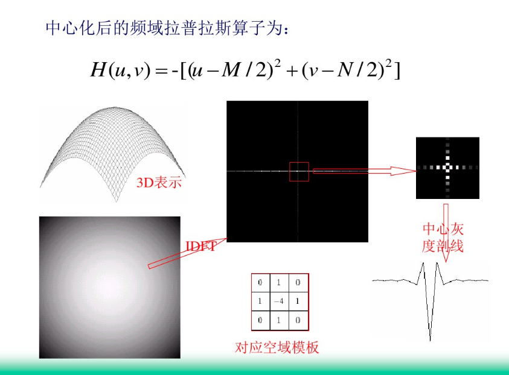


#### 同态滤波

##### 1. 同态滤波概念

同态滤波是一种在频域中同时将图像亮度范围进行压缩并将图像对比度增强的方法. 同态滤波增强属于图像频域处理范畴, 作用是对图像灰度范围进行调整, 
通过消除图像上照度不均匀的问题, 增强图像的细节, 同时对不损失亮区的图像细节.

一幅图像如果由亮度成像模型表示, 则能够使用它的入射光分量和反射光分量来表示, 关系如下:

```
f(x, y) = i(x, y) * r(x, y)                (4-1)
```

另外, 入射光分量`i(x, y)`由照明决定, 而反射光分量`r(x, y)`则是由物体本身特性决定; 入射光分量同傅里叶平面的低频分量相关, 而反射光分量
则同高频分量相关.

##### 2. 同态滤波增强

同态滤波增强是一种在频域中同时将图像亮度范围进行压缩和将图像对比度进行增强的方法. 同态滤波增强的思路是把照度/入射分量的反射分量分开来并分别
进行滤波. 处理过程如下:

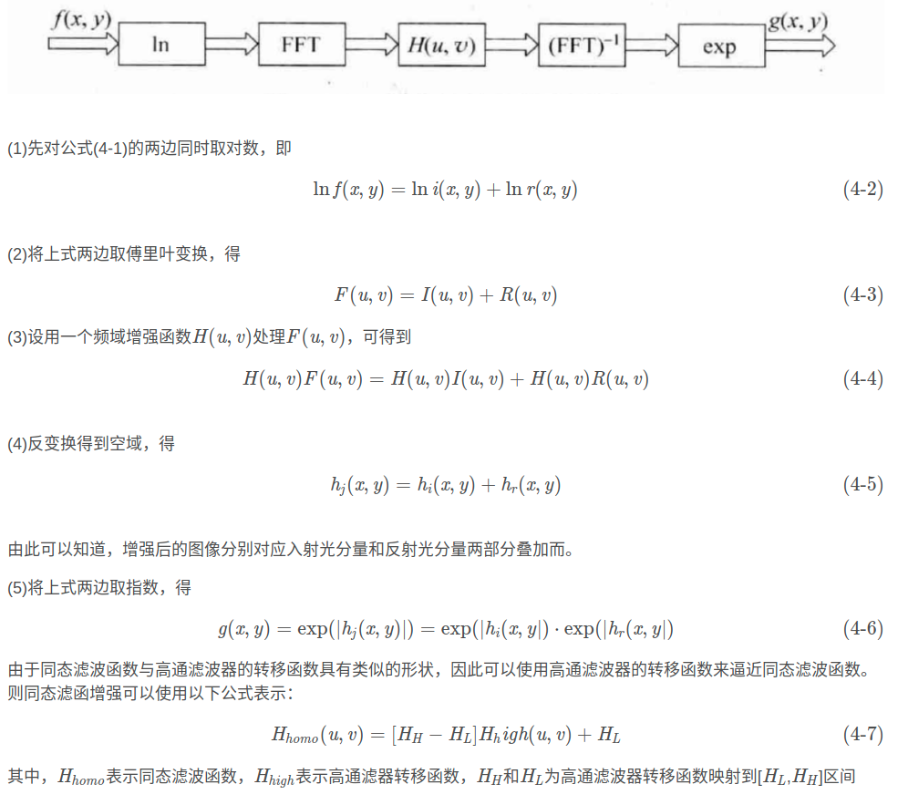

图像的照射分量通常由慢的空间变化来表征, 而反射分量往往引起突变, 特别是在不同物体的连接部分. 这些特性导致图像取对数后的傅里叶变换的低频成分
与照射相联系, 而高频成分与反射相联系. 虽然这些联系只是粗略的近似, 但它们用在图像滤波中是有益的.

使用同态滤波器可以更好地通知照射分量和反射分量. 这种控制需要指定一个滤波器函数`H(u, v)`, 它可以用不同的可控方法影响傅里叶变换的低频和高频
分量. 下图显示了这种滤波器的剖面图.

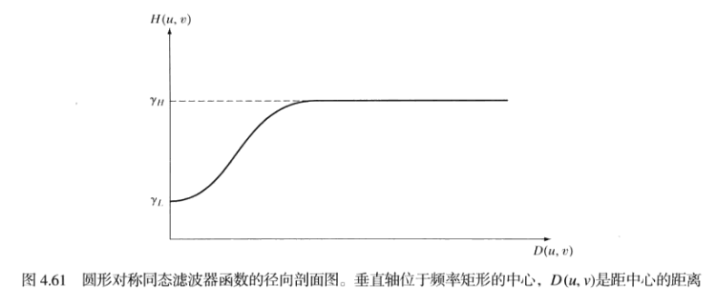

如果
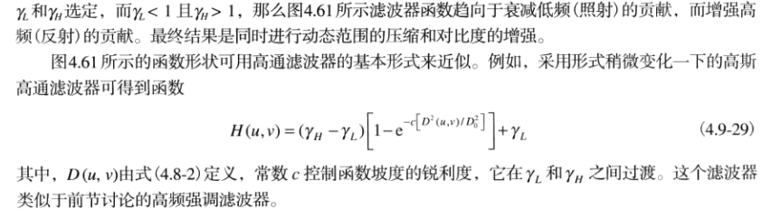


