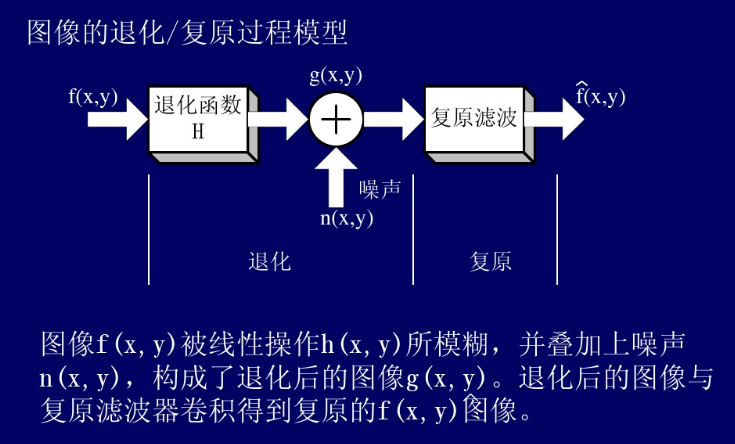
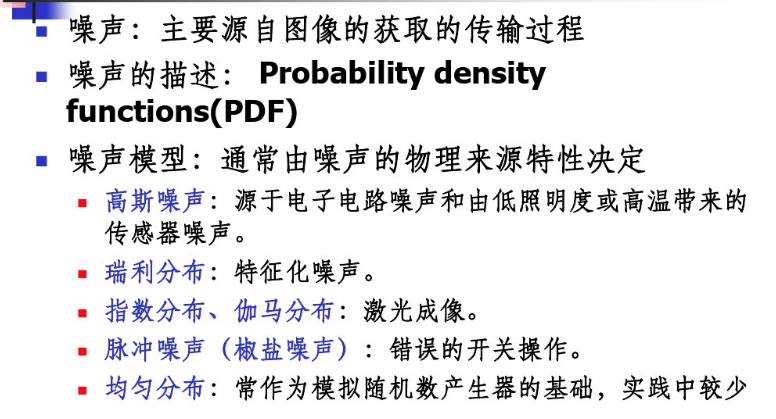
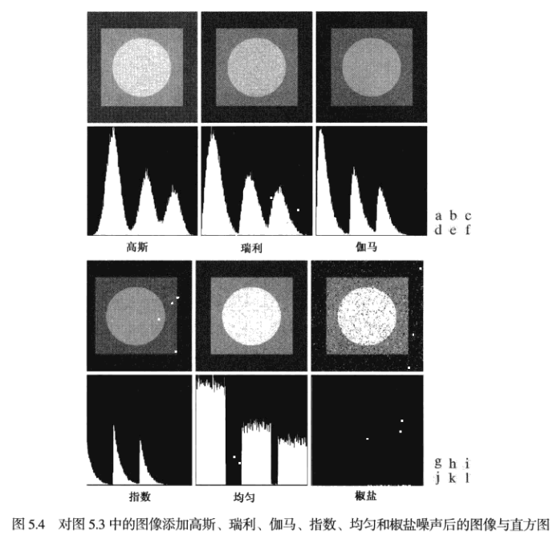
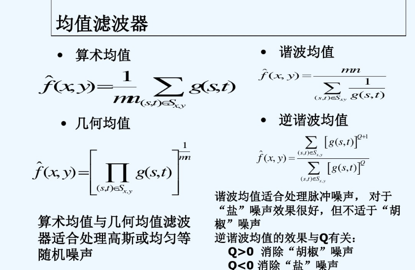

与图像增强相似, 图像复原的目的也是改善给定的图像. 
但图像增强主要是一个主观的过程, 而图像复原是一个客观的过程.

- 图像恢复: 根据g(x, y), 获取关于原图像的近似估计`f'(x, y)`

- 恢复的方法: 如果我们所知道的退化函数H和噪声n的信息愈多, 我们就能尽可能准确地估计原始输入图像.

- 如果退化函数H是**线性、空间位移不变性系统**
    - 空间域中的退化图像: g(x, y) = h(x, y)*f(x, y)+n(x, y)
    - 频率域中的表示: G(u, v) = H(u, v)F(u, v)+N(u, v)

#### 图像复原的分类

- 按照退化模型
    - 无约束: 仅将图像看做一个数字矩阵, 从数学角度处理
    - 有约束: 还考虑图像的物理约束
- 按照是否需要用户干预
    - 自动式
    - 交互式
- 按照处理所在的域
    - 空间域恢复
    - 频率域恢复

#### 噪声模型

周期噪声

- 周期噪声是在图像获取中从电力或机电干扰中产生的. 这是唯一的一种空间依赖型噪声.

#### 均值滤波器

