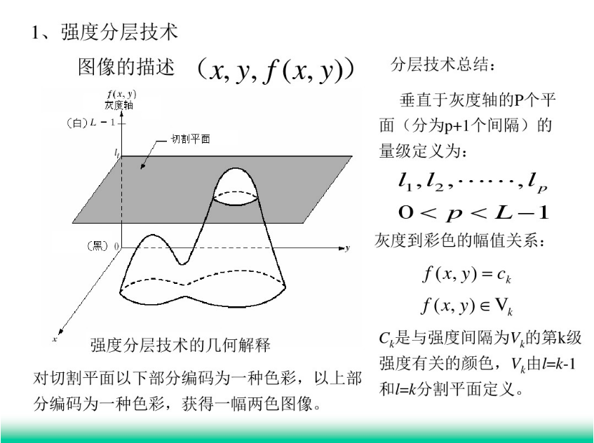
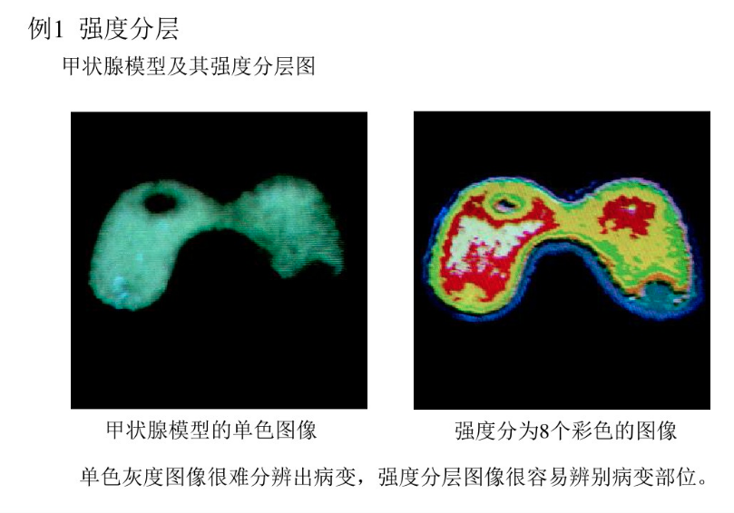
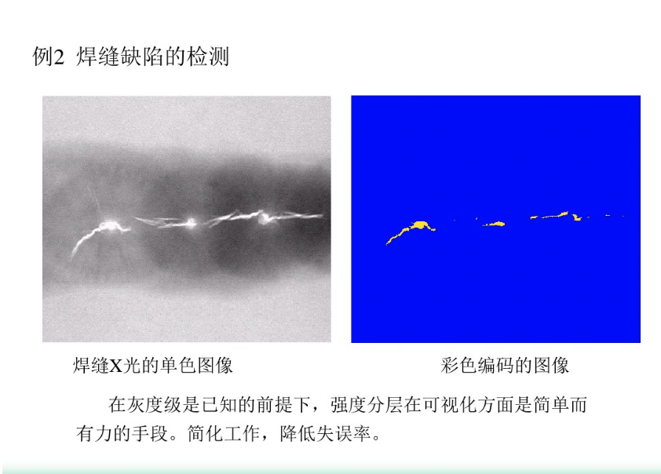
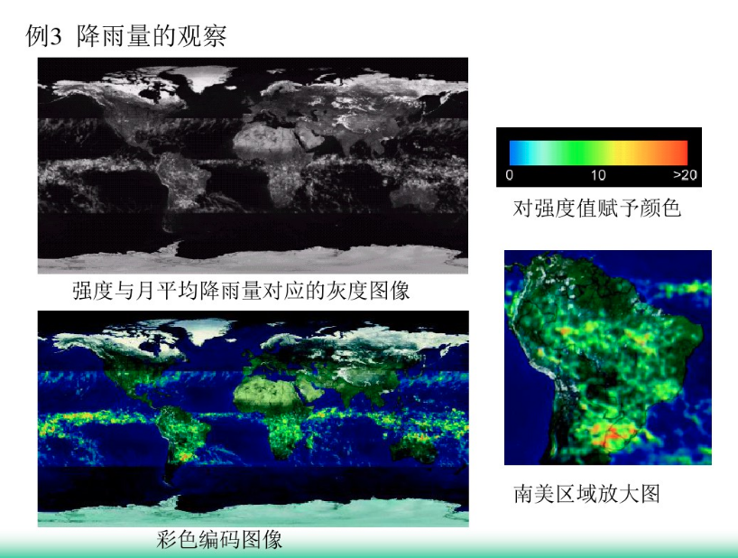

### 伪彩色处理

- 伪彩色图像处理(也称为假彩色)是根据特定的准则对灰度值赋以彩色的处理. 伪彩色或假彩色
一词用于区分全(真)彩色图像处理.

- 伪彩色的主要应用是为了人眼观察和解释一幅图像或序列图像中的灰度目标. 正像在本章开始
指明的那样, 利用彩色的主要动力之一是, 人类可以辨别上千种颜色和强度, 而相比之下只能辨别几十种灰度.

- 伪彩色处理方法:

    - (1). 强度分层
    - (2). 灰度级到彩色的转换
    
#### 强度分层技术

