### 连续小波变换(CWT, Continuous Wavelet Transform)

CWT用来代替窗口傅里叶变换(WFT)以克服分辨率不能随时间与频率的不同而改变的问题. 当窗口函数选定之后, 对WFT来说, 
时-频窗的窗口形状是固定的, 它不能随着所欲分析的信号成分是高频信息或低频信息而相应变化, 而非平稳信号都是包含丰富
的频率成分, 所以, 它们对非平稳信号的分析能力是很有限的. 小波变换类似于WFT, 即信号用小波相乘, 对时域信号的不同时间段计算小波变换.

但是WFT和小波变换之间有两个不同之处:

- (1). 加窗信号不做Fourier变换;

- (2). 小波变换的最重要特点是在计算每个频率成分时可改变窗口的形状.

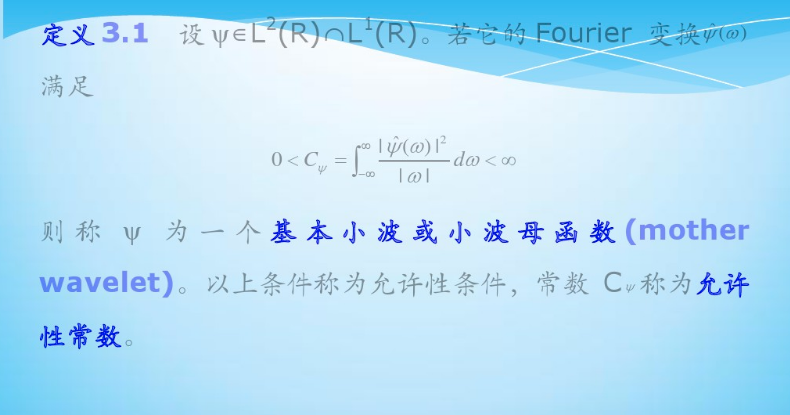

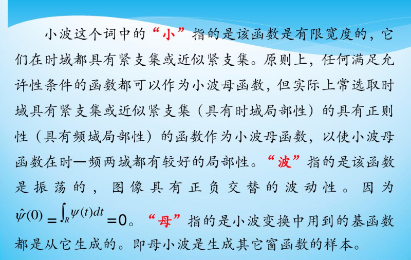

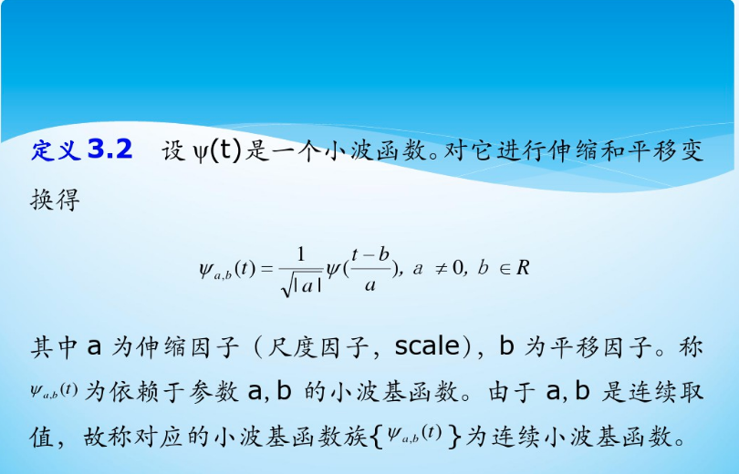

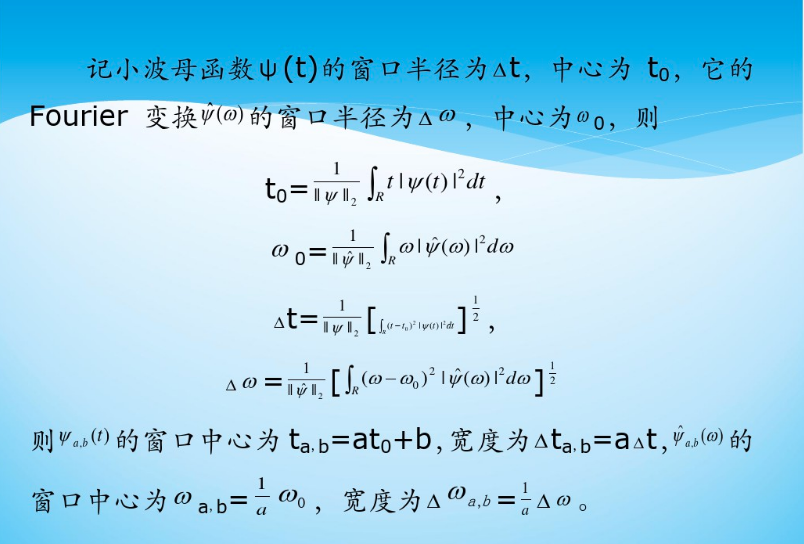

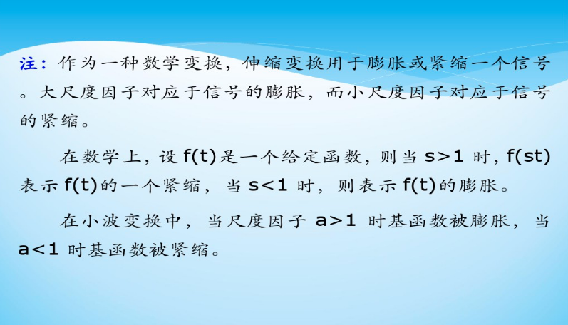

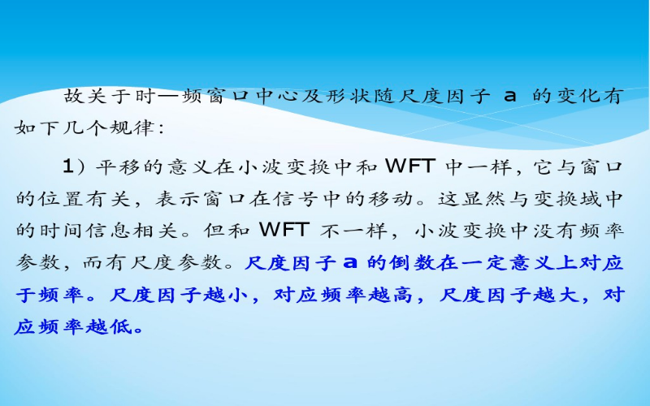

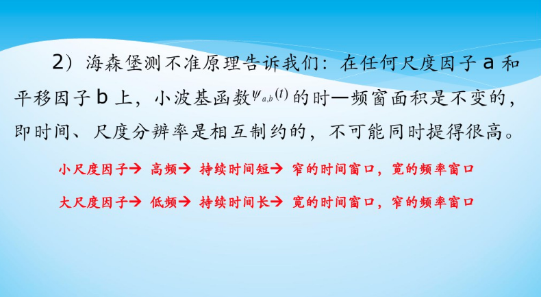

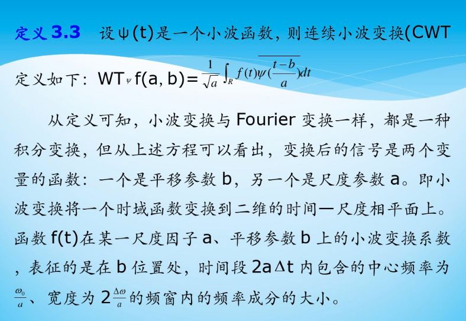

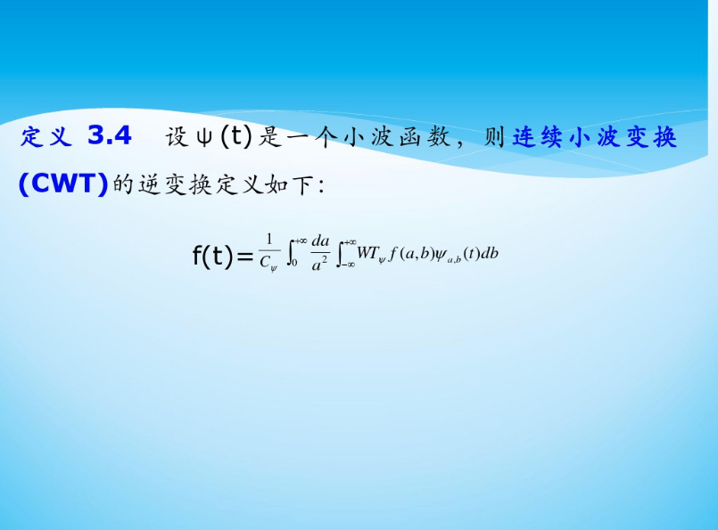

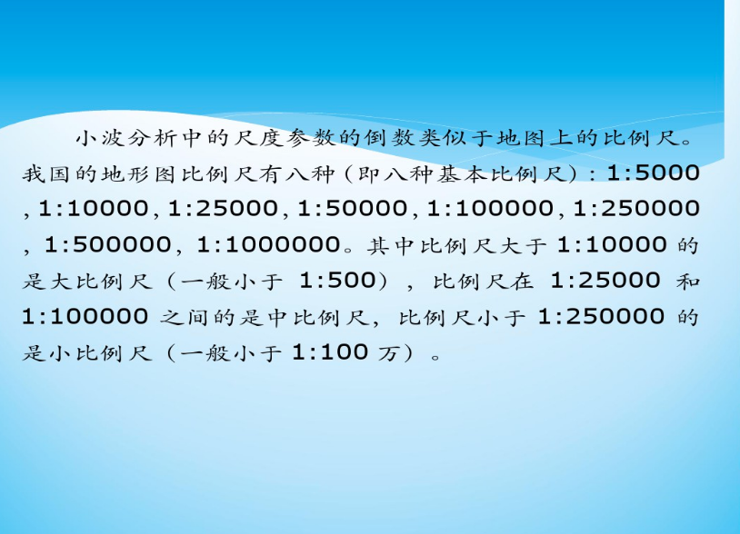

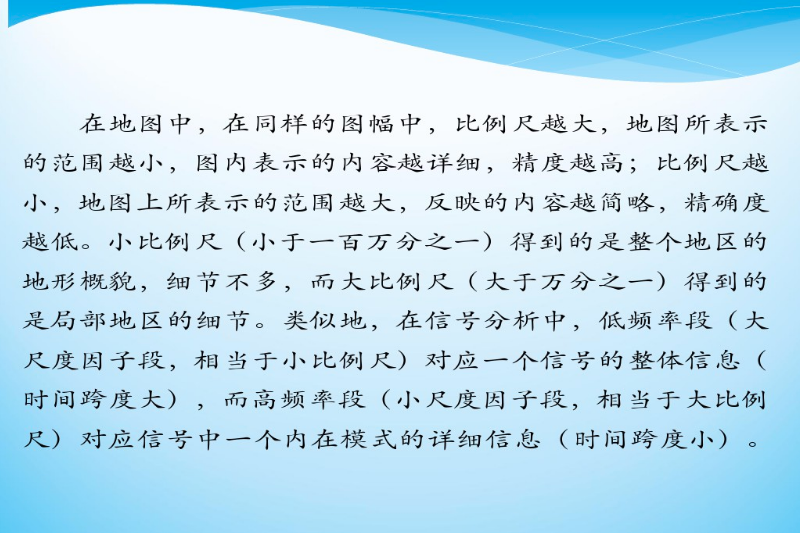

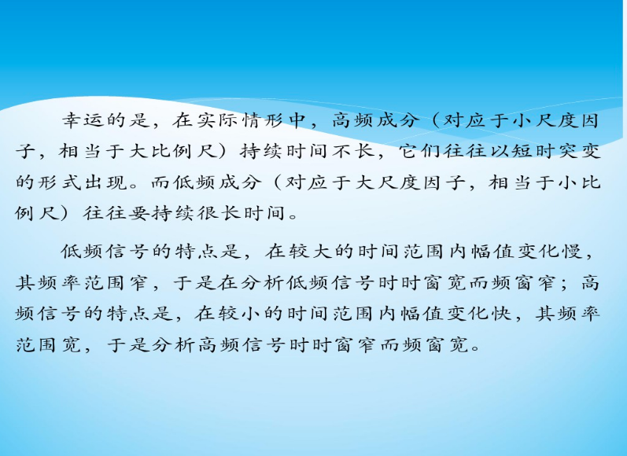

### 连续小波的计算

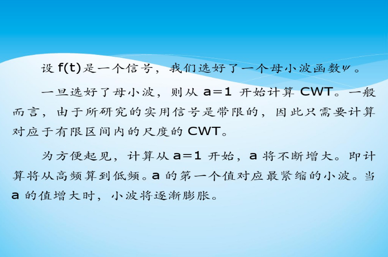

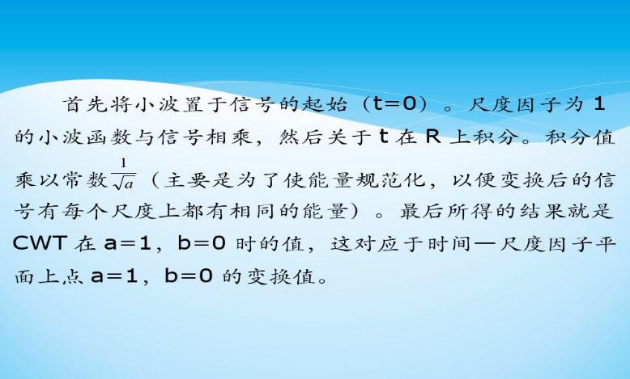

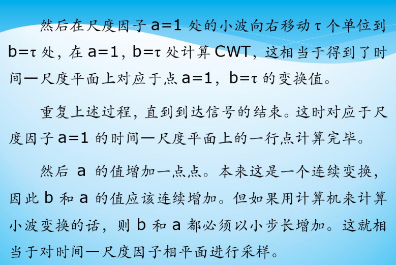

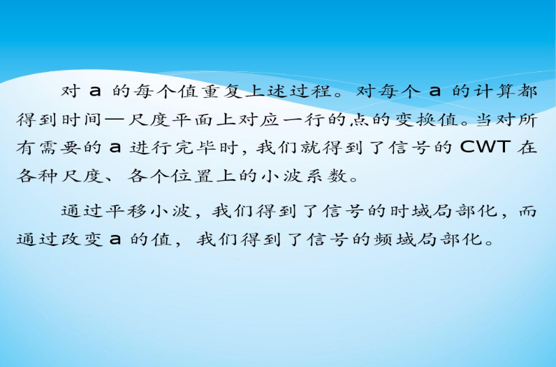

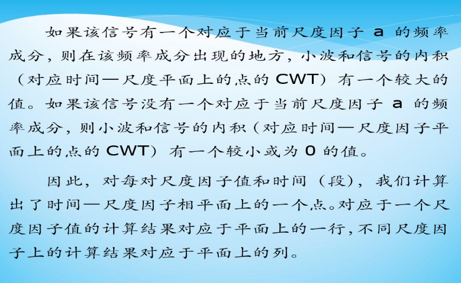

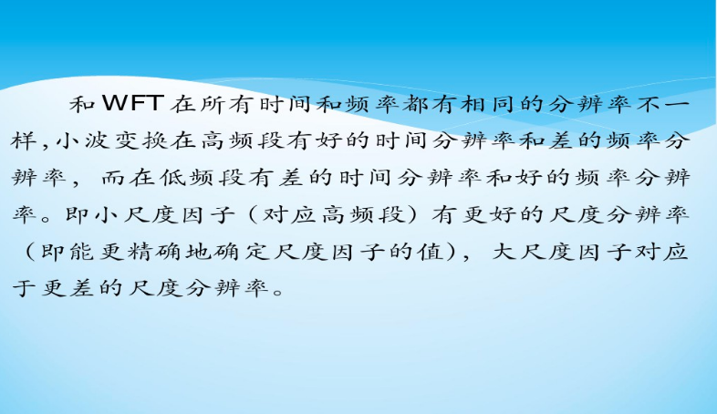

### 几种常用的连续小波基函数

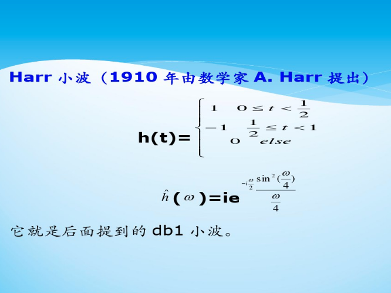

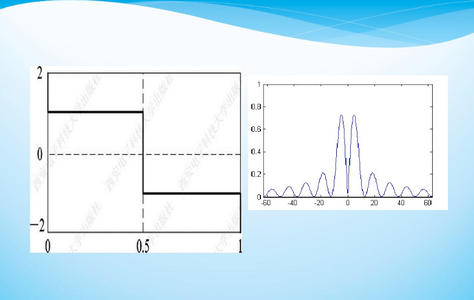

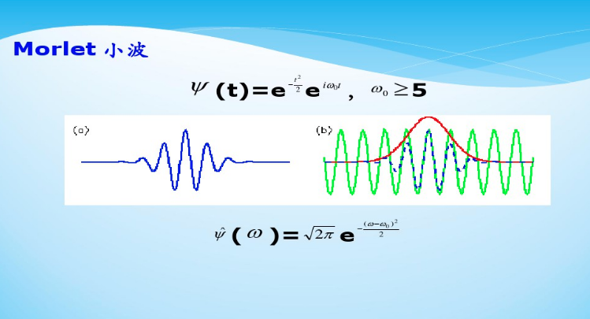

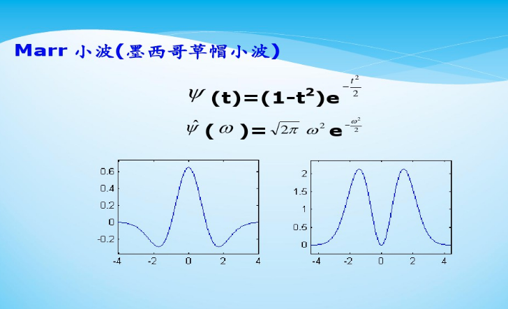

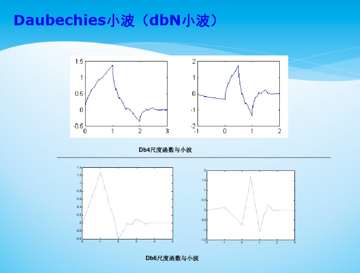

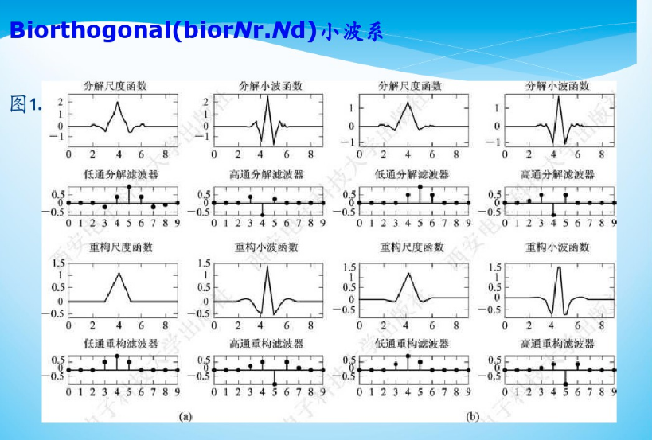

