### 图像压缩基础

- 图像压缩是一种减少描述一幅图像所需数据量的技术和科学, 它是数字图像处理领域最有用、商业上最成功的技术之一

    - 压缩的本质: 用尽可能少的数据表达尽可能多的信息
    - 图像压缩必要性实例
        - 一部两小时的标清电影, 分辨率720x240, 全彩色(24bit/pixel)
        - 如果不压缩, 存储需要224GB!
        
- Web网页图像和高分辨率数字摄像机图片需要进行压缩, 以节省存储空间和减少传输时间. 同时, 图像压缩在视
频会议、遥感、文本和医学图像处理领域扮演重要角色.

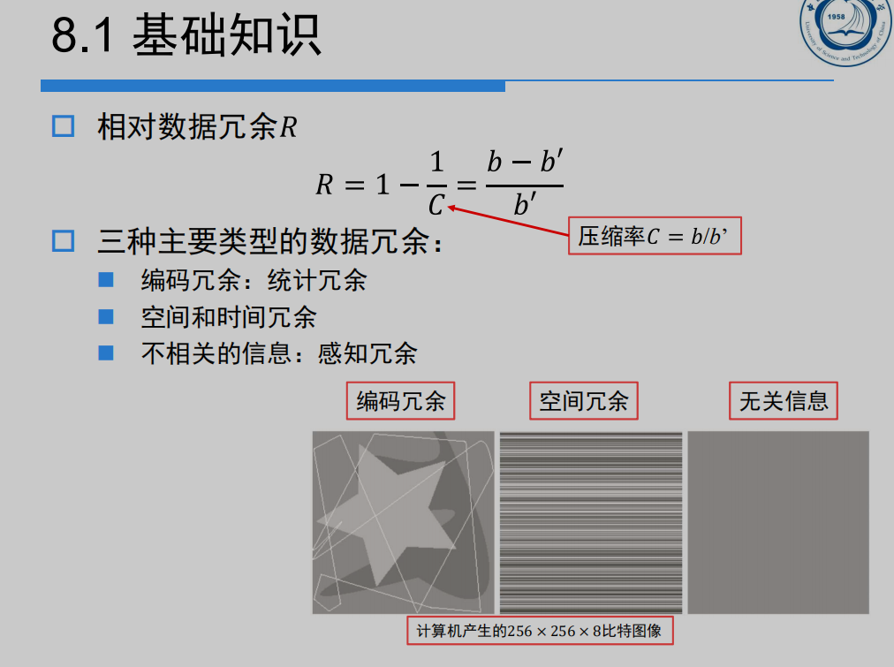

#### 编码冗余

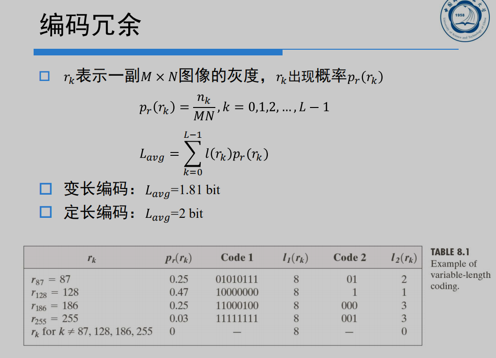

#### 空间冗余和时间冗余(像素间冗余)

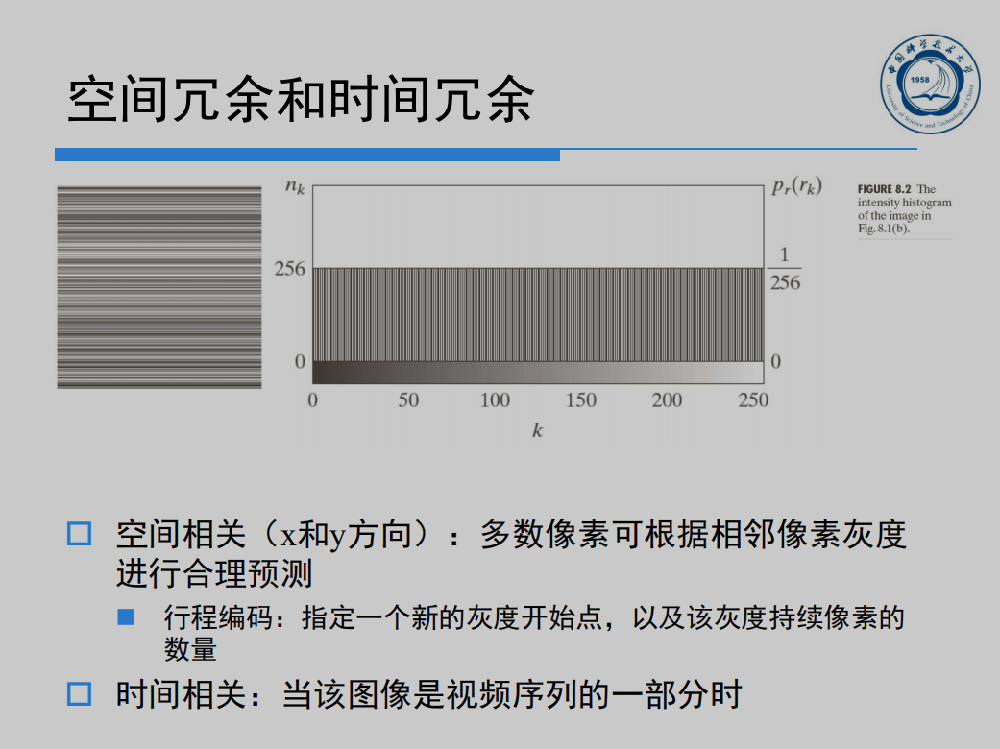

#### 感知冗余

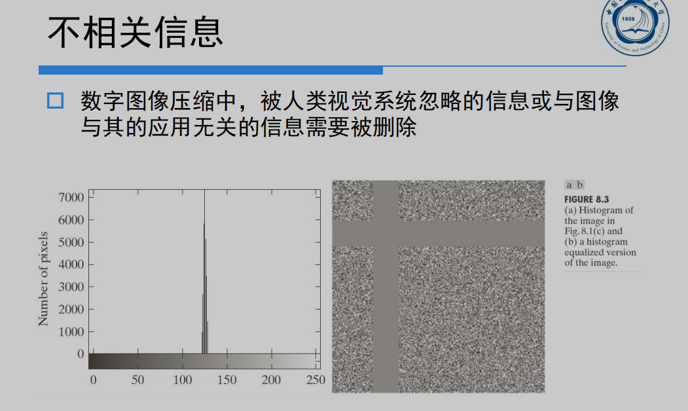

#### 图像信息的度量

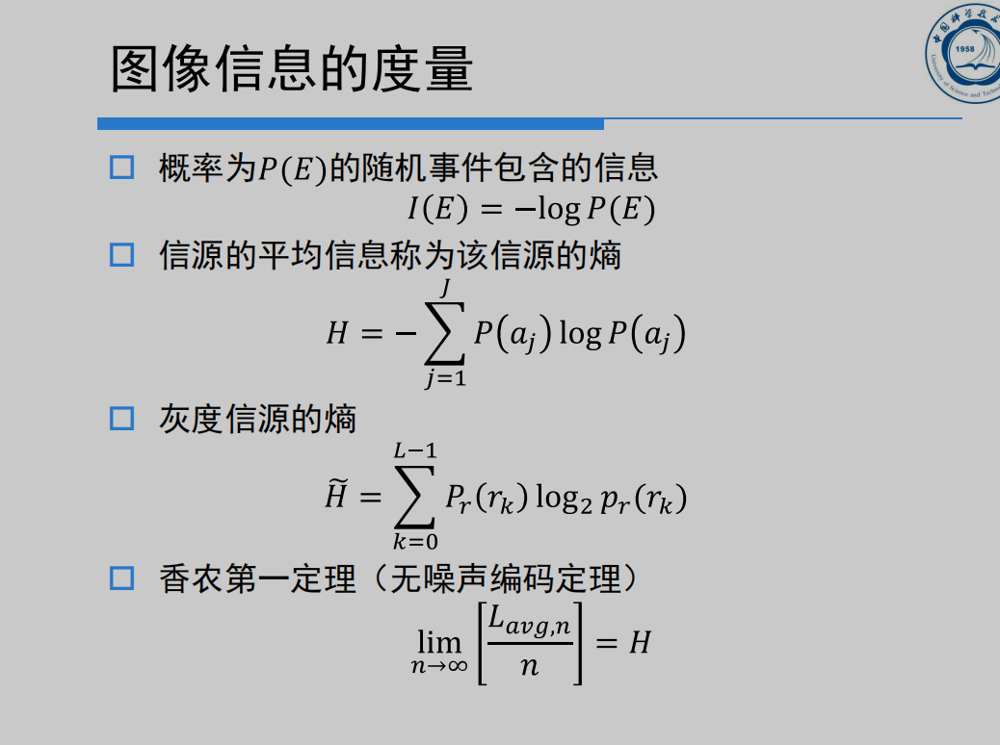

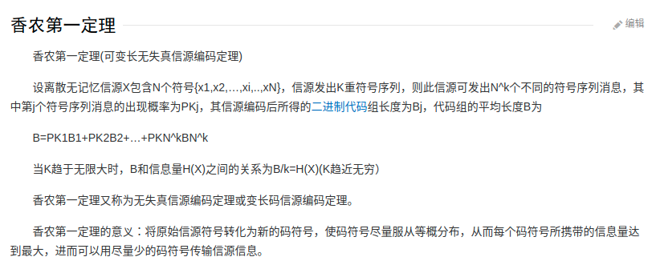

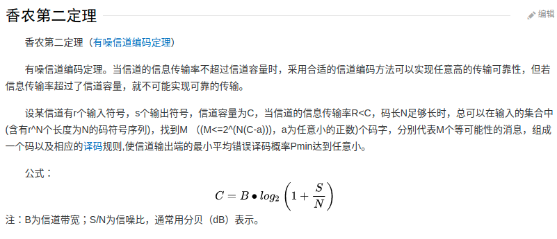

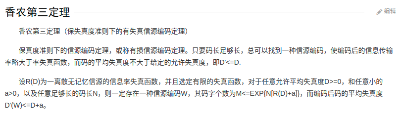

#### 保真度准则: 度量压缩质量

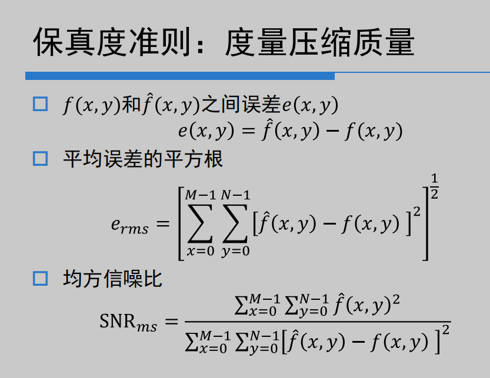

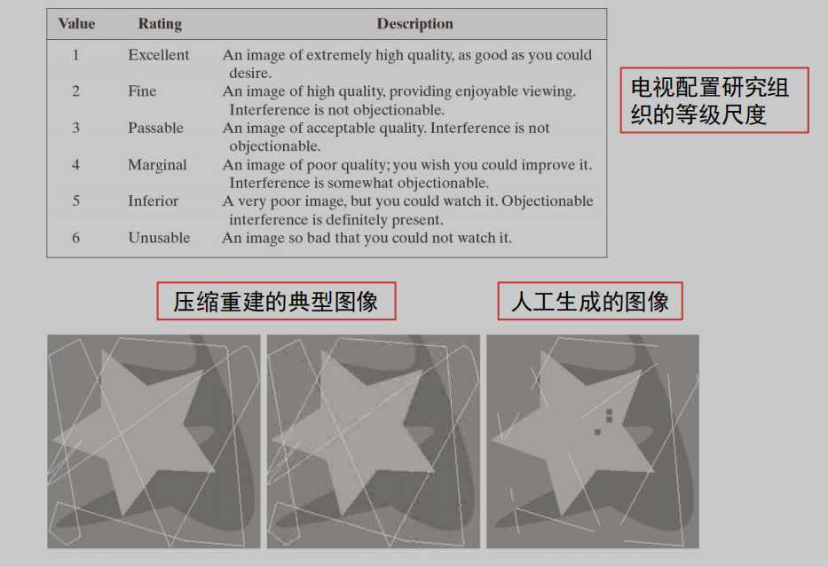

#### 图像压缩模型

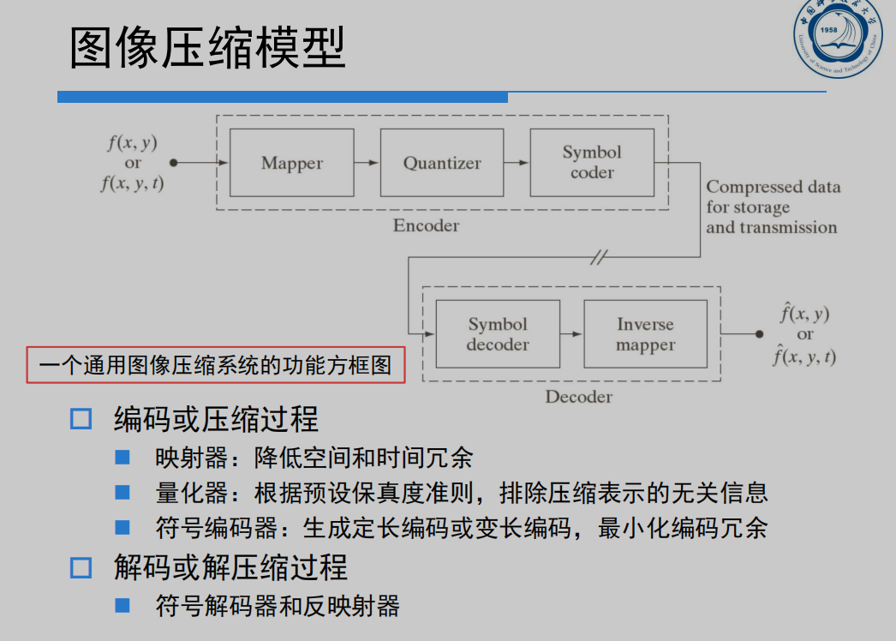

#### 图像格式、容器和压缩标准

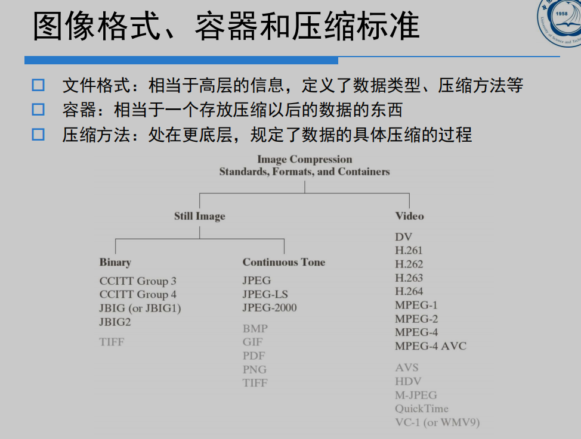

